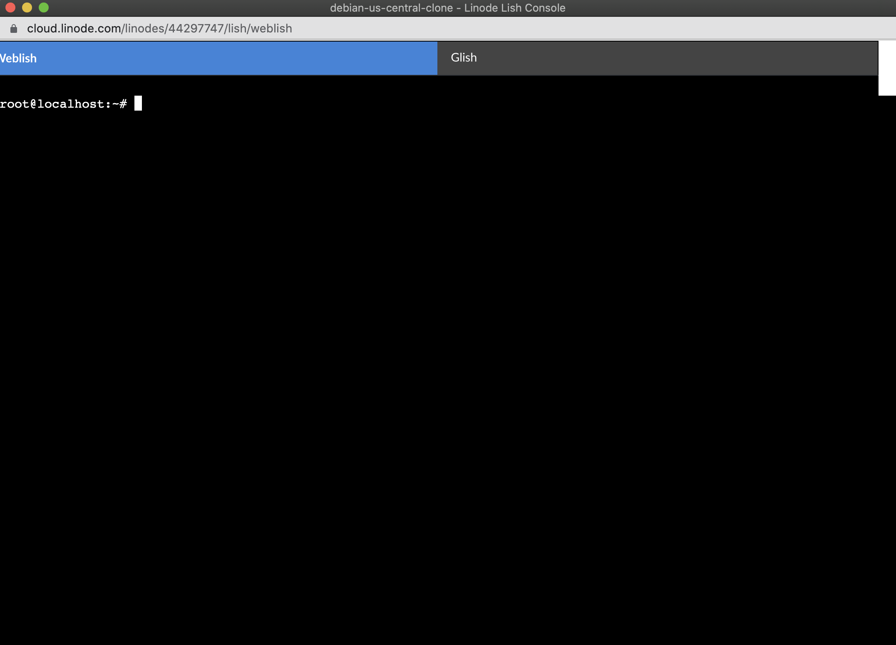
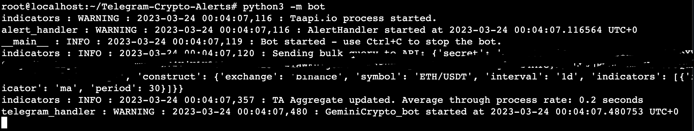

<div>
    <center>
        
        &nbsp;&nbsp;&nbsp;&nbsp;
        
    </center>
    <br>
</div>

# Set up the Telegram Crypto Alerts bot on Linode

This guide is designed to teach you how to set up the Telegram Crypto Alerts bot on a Linode cloud server. It will walk you through the process of creating a Linode account, creating a Debian 11 VM, and installing the bot on the VM, and starting the bot.

1. To get started, follow this guide to create an account on Linode and create a Debian 11 VM.

    https://scribehow.com/shared/How_to_Spin_Up_a_Debian_11_VM_on_Linode_Cloud_to_Host_the_Telegram_Crypto_Alerts_Bot__J8AKtJsSTIKH3MsWoOoO4Q

2. Once you have created the VM, you should still be in the popup console window, and logged in (see step 11 & 12 in the previous guide)

    

3. Now, we need to install the bot. To do this, we will run the following commands (in order):

    Fetch the install script:

    ```bash
    wget https://raw.githubusercontent.com/hschickdevs/Telegram-Crypto-Alerts/development/bash/install.sh
    ```

    Then run:

    ```bash
    bash install.sh
    ```

    The Telegram bot files and dependencies will now be installed.

4. Now, we need to run the setup script.

    Before we do this, make sure that you have the following information ready:

    - Your Telegram bot token
    - Your Telegram chat ID (see https://t.me/raw_data_bot)
    - 2 [Taapi.io](https://taapi.io/) API keys
        * First one is for the alerts handler
        * Second once is for the message handler

    Once you have this information ready, run the setup script using the following comamnds:

    ```bash
    bash setup.sh
    ```

    If you see the output shown below, you have successfully set up the bot:

    `Setup complete! You can now run the bot module using: python3 -m bot.`

5. Finally, you can run the bot using the `start ` script:

    ```bash
    bash start.sh
    ```

If you were successful, you should now see similar to the following output in your command console:



For usage and commands, please refer back to the [main README.md file](../README.md#telegram-bot-commands).